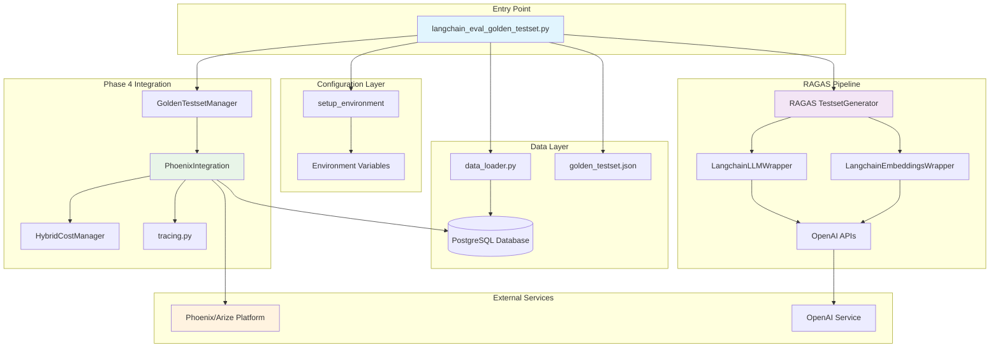
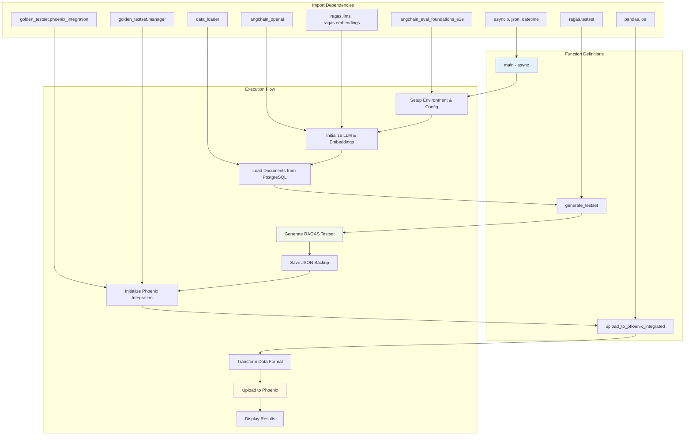
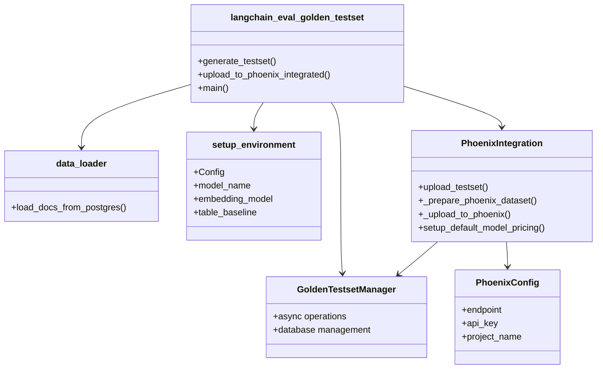
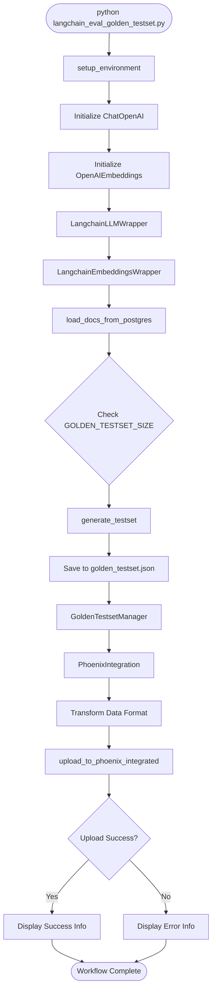
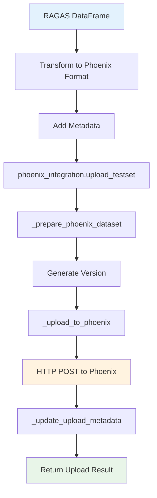
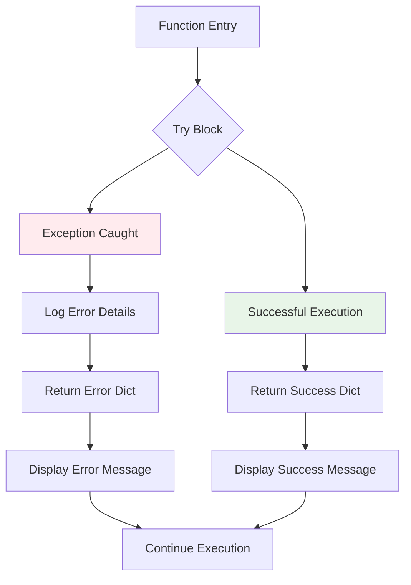

# RAGAS to Phoenix Integration - Code Dependencies and Flow

This document captures the code architecture, dependencies, and execution flow for the RAGAS golden testset to Phoenix integration.

## Architecture Overview



## Code Dependencies Flow



## Module Dependencies

### Core Application Files



## Detailed Function Flow

### 1. Main Function Execution



### 2. RAGAS Generation Pipeline

```mermaid
flowchart LR
    subgraph "RAGAS Internal Pipeline"
        A[HeadlinesExtractor] --> B[HeadlineSplitter]
        B --> C[SummaryExtractor]
        C --> D[CustomNodeFilter]
        D --> E[EmbeddingExtractor]
        E --> F[ThemesExtractor]
        F --> G[NERExtractor]
        G --> H[CosineSimilarityBuilder]
        H --> I[OverlapScoreBuilder]
        I --> J[Generate Personas]
        J --> K[Generate Scenarios]
        K --> L[Generate Q&A Pairs]
    end

    Input[Document List] --> A
    L --> Output[DataFrame with testset]

    style A fill:#ffebee
    style L fill:#e8f5e8
```



### 3. Phoenix Upload Process



## Data Structure Transformations

### RAGAS DataFrame → Phoenix Format

```python
# Input: RAGAS DataFrame
{
    "user_input": str,
    "reference": str,
    "reference_contexts": List[str],
    "synthesizer_name": str,
    "evolution_type": str
}

# Transformation Logic
def transform_ragas_to_phoenix(df):
    testset_data = {
        "examples": [],
        "metadata": {
            "source": "ragas_golden_testset",
            "generation_method": "automated",
            "created_at": datetime.now().isoformat(),
            "num_samples": len(df)
        }
    }

    for _, row in df.iterrows():
        example = {
            "question": row["user_input"],
            "ground_truth": row["reference"],
            "contexts": row["reference_contexts"],
            "metadata": {
                "synthesizer_name": row.get("synthesizer_name"),
                "source": "ragas_testset_generator"
            }
        }
        testset_data["examples"].append(example)

    return testset_data

# Output: Phoenix Compatible Format
{
    "examples": [
        {
            "question": str,
            "ground_truth": str,
            "contexts": List[str],
            "metadata": Dict[str, Any]
        }
    ],
    "metadata": Dict[str, Any]
}
```

## Configuration Dependencies

### Environment Variables
- `GOLDEN_TESTSET_SIZE`: Controls testset size
- `OPENAI_API_KEY`: Required for RAGAS generation
- `DATABASE_URL`: PostgreSQL connection
- `PHOENIX_ENDPOINT`: Phoenix platform endpoint

### Model Configuration
- **LLM Model**: `gpt-4.1-mini` (hardcoded)
- **Embedding Model**: `text-embedding-3-small` (hardcoded)
- **Database Table**: `mixed_baseline_documents`

## Error Handling Flow



## File I/O Operations

### Input Files
- **Database**: PostgreSQL `mixed_baseline_documents` table
- **Config**: Environment variables and setup configuration

### Output Files
- **Local Backup**: `golden_testset.json` (RAGAS format)
- **Phoenix Dataset**: Versioned upload to Phoenix platform
- **Database Metadata**: Upload tracking in PostgreSQL

## Async/Await Pattern

```python
# Main execution pattern
async def main():
    # Sync operations
    config = setup_environment()
    llm = ChatOpenAI(model=config.model_name)

    # Sync RAGAS generation
    golden_testset_df = generate_testset(docs, llm, embeddings, size)

    # Async Phoenix operations
    phoenix_integration = PhoenixIntegration(manager, config)
    result = await upload_to_phoenix_integrated(df, phoenix_integration)

    return result

# Entry point
if __name__ == "__main__":
    asyncio.run(main())
```

## Integration Points with Phase 4 Architecture

### Phoenix Integration Class Usage
```python
# Initialization
manager = GoldenTestsetManager()
phoenix_config = PhoenixConfig()
phoenix_integration = PhoenixIntegration(manager, phoenix_config)

# Upload operation
result = await phoenix_integration.upload_testset(testset_data)
```

### Cost Tracking Integration
- Uses `HybridCostManager` for token usage tracking
- OpenTelemetry tracing via `tracing.py`
- Session-based cost aggregation

### Database Integration
- PostgreSQL for document storage and metadata
- Async operations via `GoldenTestsetManager`
- Version tracking and audit trails

This architecture provides a robust, scalable solution for generating and managing golden testsets with full Phoenix platform integration.