# RAGAS to Phoenix Integration - Sequence Diagram

This document captures the end-to-end sequence flow for generating RAGAS golden testsets and uploading them to Phoenix using our Phase 4 integration architecture.

## Overview

The integration enables automated generation of high-quality golden testsets using RAGAS (Retrieval-Augmented Generation Assessment) and seamless upload to Arize Phoenix for observability and evaluation tracking.

## Sequence Diagram

```mermaid
sequenceDiagram
    participant User
    participant Script as langchain_eval_golden_testset.py
    participant Config as setup_environment()
    participant DB as PostgreSQL
    participant RAGAS as RAGAS TestsetGenerator
    participant OpenAI as OpenAI API
    participant Manager as GoldenTestsetManager
    participant Phoenix as PhoenixIntegration
    participant PhoenixUI as Phoenix/Arize Platform

    User->>Script: python langchain_eval_golden_testset.py

    Note over Script,Config: Phase 1: Environment Setup
    Script->>Config: setup_environment()
    Config-->>Script: Configuration object
    Script->>OpenAI: Initialize ChatOpenAI & OpenAIEmbeddings
    OpenAI-->>Script: LLM and embedding models ready

    Note over Script,DB: Phase 2: Data Loading
    Script->>DB: load_docs_from_postgres(table_baseline)
    DB-->>Script: 93 PDF documents loaded

    Note over Script,RAGAS: Phase 3: RAGAS Golden Testset Generation
    Script->>RAGAS: TestsetGenerator(llm, embeddings)
    RAGAS-->>Script: Generator instance created

    Script->>RAGAS: generate_with_langchain_docs(docs, testset_size)

    Note over RAGAS,OpenAI: RAGAS Processing Pipeline
    RAGAS->>OpenAI: Apply HeadlinesExtractor
    OpenAI-->>RAGAS: Document headlines extracted
    RAGAS->>OpenAI: Apply SummaryExtractor
    OpenAI-->>RAGAS: Document summaries generated
    RAGAS->>OpenAI: Apply EmbeddingExtractor
    OpenAI-->>RAGAS: Embeddings computed
    RAGAS->>OpenAI: Generate personas & scenarios
    OpenAI-->>RAGAS: Test scenarios created
    RAGAS->>OpenAI: Generate questions & answers
    OpenAI-->>RAGAS: Golden testset examples

    RAGAS-->>Script: golden_testset_dataframe (DataFrame)

    Note over Script: Phase 4: Local Persistence
    Script->>Script: Save to golden_testset.json

    Note over Script,Phoenix: Phase 5: Phoenix Integration Setup
    Script->>Manager: GoldenTestsetManager()
    Manager-->>Script: Manager instance
    Script->>Phoenix: PhoenixIntegration(manager, config)
    Phoenix-->>Script: Phoenix integration ready

    Note over Script,Phoenix: Phase 6: Data Transformation
    Script->>Script: Transform RAGAS DataFrame to Phoenix format
    Note right of Script: Convert to testset_data structure:<br/>- examples[]<br/>- metadata{}

    Note over Script,PhoenixUI: Phase 7: Phoenix Upload
    Script->>Phoenix: upload_testset(testset_data)
    Phoenix->>Phoenix: _prepare_phoenix_dataset()
    Phoenix->>Phoenix: Generate version & dataset_name
    Phoenix->>PhoenixUI: HTTP POST /datasets
    PhoenixUI-->>Phoenix: Dataset upload confirmation
    Phoenix->>Manager: update_upload_metadata()
    Manager->>DB: Store upload metadata
    Phoenix-->>Script: Upload result with dataset_id

    Note over Script,User: Phase 8: Results Display
    Script->>User: Display upload status
    alt Upload Success
        Script->>User: ✅ Phoenix upload successful!<br/>📦 Dataset: mixed_golden_testset_phoenix<br/>🏷️ Version: X.X.X<br/>📊 Samples: N<br/>🆔 Phoenix ID: dataset_id
    else Upload Failed
        Script->>User: ❌ Phoenix upload failed: error_message
    end

    Script->>User: 🎉 Workflow completed!

    Note over User,PhoenixUI: Phase 9: Data Verification
    User->>PhoenixUI: Access http://localhost:6006
    PhoenixUI-->>User: View uploaded golden testset data
```



## Key Integration Points

### 1. Environment Setup
- Configuration loaded from centralized system
- OpenAI models initialized (gpt-4.1-mini, text-embedding-3-small)
- Database connections established

### 2. Data Loading
- PostgreSQL documents loaded from `mixed_baseline_documents` table
- Typically 93 PDF documents from research sources

### 3. RAGAS Generation Pipeline
- **HeadlinesExtractor**: Extract document section headers
- **SummaryExtractor**: Generate document summaries using LLM
- **EmbeddingExtractor**: Compute embeddings for semantic analysis
- **Persona Generation**: Create test user personas
- **Scenario Generation**: Generate test scenarios and contexts
- **Question/Answer Generation**: Create question-answer pairs with ground truth

### 4. Phoenix Integration (Phase 4 Architecture)
- Uses `PhoenixIntegration` class with versioned uploads
- Transforms RAGAS DataFrame to Phoenix-compatible format
- Includes comprehensive metadata and versioning
- Stores upload metadata in PostgreSQL for tracking

### 5. Data Format Transformation
```python
# RAGAS DataFrame format:
{
    "user_input": "What factors influence AI trust?",
    "reference": "Trust is influenced by...",
    "reference_contexts": ["context1", "context2"],
    "synthesizer_name": "simple"
}

# Phoenix format:
{
    "examples": [
        {
            "question": "What factors influence AI trust?",
            "ground_truth": "Trust is influenced by...",
            "contexts": ["context1", "context2"],
            "metadata": {
                "synthesizer_name": "simple",
                "source": "ragas_testset_generator"
            }
        }
    ],
    "metadata": {
        "source": "ragas_golden_testset",
        "generation_method": "automated",
        "num_samples": 10
    }
}
```

## Configuration

### Environment Variables
- `GOLDEN_TESTSET_SIZE`: Number of examples to generate (default: 10)
- `OPENAI_API_KEY`: Required for RAGAS generation
- `DATABASE_URL`: PostgreSQL connection for document loading
- `PHOENIX_ENDPOINT`: Phoenix platform endpoint

### File Outputs
- `golden_testset.json`: Local backup of generated testset
- Phoenix dataset: Versioned upload with timestamped name
- PostgreSQL metadata: Upload tracking and versioning info

## Benefits

### 1. Automated Quality
- AI-powered generation ensures diverse, high-quality test cases
- Semantic analysis creates realistic scenarios
- Multiple synthesis strategies (simple, complex, reasoning)

### 2. Observability Integration
- Phoenix platform provides visual analysis of testsets
- Version tracking for testset evolution
- Integration with broader Phoenix observability ecosystem

### 3. Scalability
- Configurable testset sizes
- Batch processing capabilities
- Versioned uploads prevent data loss

### 4. Reproducibility
- Deterministic generation with seed control
- Metadata tracking for audit trails
- Local backup ensures data persistence

## Usage

```bash
# Generate and upload with default size (10 examples)
python src/langchain_eval_golden_testset.py

# Generate smaller testset for testing
GOLDEN_TESTSET_SIZE=3 python src/langchain_eval_golden_testset.py

# View results in Phoenix UI
open http://localhost:6006
```

## Error Handling

The integration includes comprehensive error handling:
- Graceful fallback if Phoenix is unavailable
- Detailed error reporting with context
- Local persistence ensures no data loss
- Retry mechanisms for transient failures

## Phase 4 Integration Benefits

This implementation represents the core value delivery of Phase 4:
- ✅ Versioned Phoenix dataset upload
- ✅ Integration with existing golden testset management
- ✅ Cost tracking and observability
- ✅ Scalable, production-ready architecture